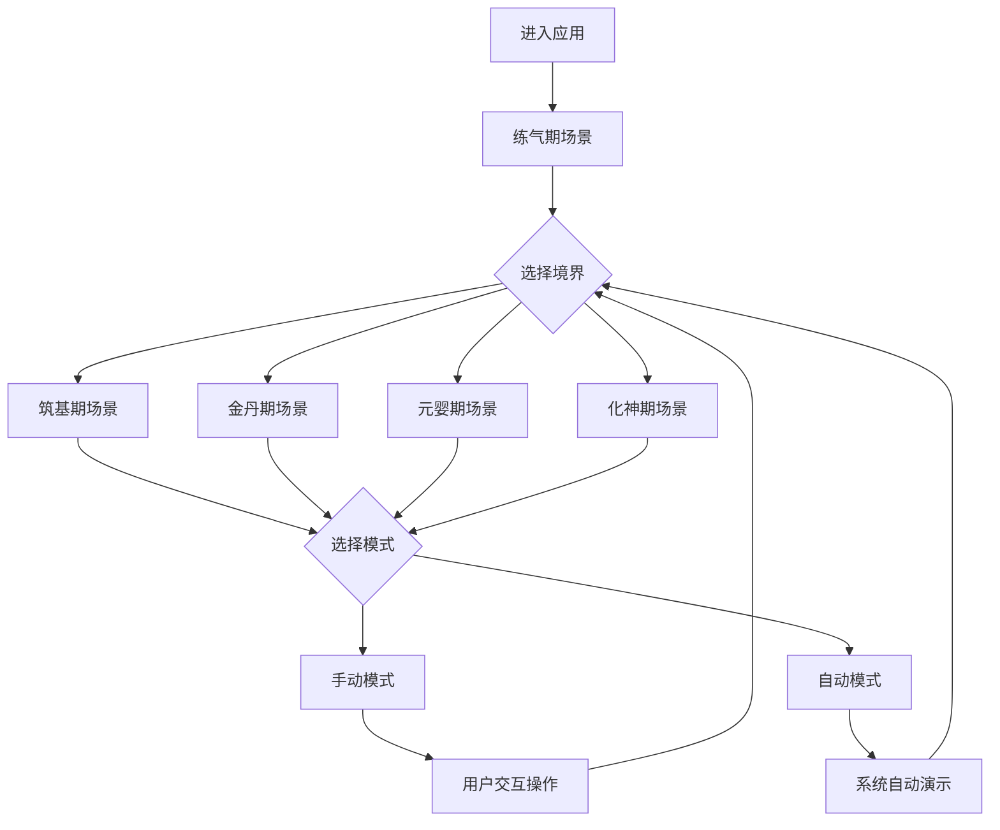

# 修真模拟器：心智进化 - 产品需求文档

## 1. Product Overview
修真模拟器：心智进化是一个交互式3D可视化单页Web应用，通过演示修真各个境界的经络运行复杂度，让用户直观体验认知跃迁的艰难过程。
- 核心目标：通过可视化技术展现修真境界的复杂性递增，帮助用户理解认知进化的困难性
- 目标市场：对修真文化感兴趣的用户、3D可视化爱好者、教育演示场景

## 2. Core Features

### 2.1 Feature Module
我们的修真模拟器包含以下主要页面：
1. **主应用页面**：境界导航栏、3D/2D可视化画布区域、交互控制面板

### 2.2 Page Details

| Page Name | Module Name | Feature description |
|-----------|-------------|---------------------|
| 主应用页面 | 境界导航栏 | 提供练气、筑基、金丹、元婴、化神五个境界切换按钮，高亮显示当前选中境界 |
| 主应用页面 | 可视化画布区 | 根据选中境界动态渲染对应的2D SVG或3D Three.js场景，支持交互操作 |
| 主应用页面 | 练气期场景 | SVG绘制简单2D经络图，支持手动点击穴位序列和自动演示模式 |
| 主应用页面 | 筑基期场景 | SVG绘制复杂2D蜘蛛网络图，增加路径复杂度和穴位提示功能 |
| 主应用页面 | 金丹期场景 | React Three Fiber创建3D球状经络网络，支持鼠标旋转缩放、自动相机动画和光路演示 |
| 主应用页面 | 元婴期场景 | HTML/CSS Grid实现细胞自动机，支持手动设置初始状态和预设模式演化 |
| 主应用页面 | 化神期场景 | React Three Fiber创建克莱因瓶/超立方体动画，提供Shader材质特效和哲学文本展示 |
| 主应用页面 | 控制面板 | 提供手动模式/自动模式切换按钮，显示当前境界说明文字和操作指引 |

## 3. Core Process

**用户操作流程：**
1. 用户进入应用，默认显示练气期场景
2. 用户可通过导航栏切换不同境界
3. 在每个境界中，用户可选择手动模式或自动模式
4. 手动模式：用户需按正确顺序点击穴位/节点完成修真
5. 自动模式：系统自动演示完整的修真过程
6. 用户可随时切换境界体验不同复杂度的挑战

## 4. User Interface Design

### 4.1 Design Style
- **主色调**：深蓝色(#1e3a8a)和金色(#fbbf24)，体现修真的神秘感
- **辅助色**：紫色(#7c3aed)用于高亮，绿色(#10b981)表示成功状态
- **按钮样式**：圆角设计，支持悬停和点击状态变化
- **字体**：系统默认字体，标题使用较大字号(text-2xl)，正文使用中等字号(text-base)
- **布局风格**：顶部导航栏 + 主内容区 + 底部控制面板的经典布局
- **图标样式**：简洁的几何图形，支持发光效果

### 4.2 Page Design Overview

| Page Name | Module Name | UI Elements |
|-----------|-------------|-------------|
| 主应用页面 | 境界导航栏 | 水平排列的五个圆角按钮，当前选中状态用金色背景高亮，字体为白色粗体 |
| 主应用页面 | 可视化画布区 | 占据页面主要区域，深色背景(bg-gray-900)，支持全屏显示 |
| 主应用页面 | 练气期场景 | SVG元素：圆形穴位节点(默认灰色，激活时绿色发光)，连接线条(细线，激活时加粗) |
| 主应用页面 | 筑基期场景 | 更密集的SVG网络，节点更小更多，增加穴位名称标签显示 |
| 主应用页面 | 金丹期场景 | 3D Canvas全屏，球形节点材质支持发光效果，连接线支持流光动画 |
| 主应用页面 | 元婴期场景 | CSS Grid网格，每个格子可点击切换状态，支持不同颜色表示生命状态 |
| 主应用页面 | 化神期场景 | 3D Canvas，复杂几何体动画，支持Shader特效和粒子系统 |
| 主应用页面 | 控制面板 | 底部固定位置，包含模式切换按钮和文字说明区域，半透明背景 |

### 4.3 Responsiveness
应用采用桌面优先设计，针对大屏幕优化3D渲染性能。支持基本的移动端适配，但3D交互功能在移动设备上可能受限。触摸设备支持基本的点击和滑动操作。