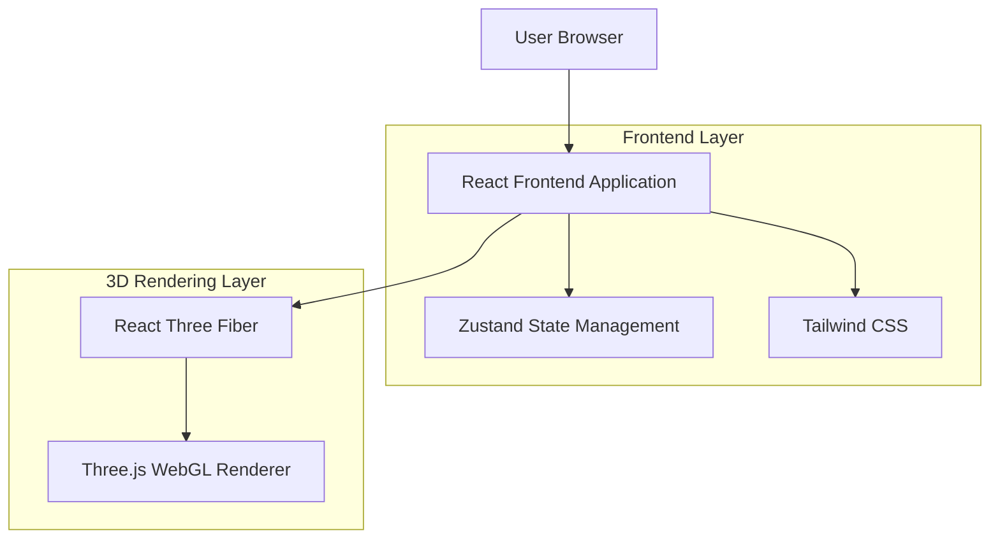
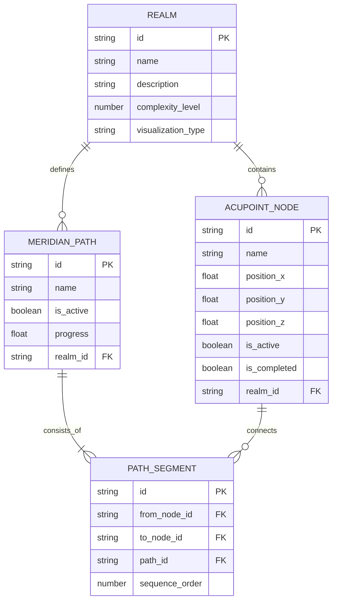

# 修真模拟器：心智进化 - 技术架构文档

## 1. Architecture design



## 2. Technology Description

* Frontend: React\@18 + TypeScript\@5 + Vite\@5

* 3D Engine: @react-three/fiber\@8 + @react-three/drei\@9 + three\@0.158

* Styling: tailwindcss\@3

* State Management: zustand\@4

* Animation: @react-spring/three\@9 (可选)

## 3. Route definitions

| Route | Purpose                 |
| ----- | ----------------------- |
| /     | 主应用页面，包含所有境界的可视化场景和交互控制 |

注：本应用为单页应用，通过状态管理实现境界切换，无需路由系统。

## 4. API definitions

### 4.1 Core Types

境界枚举定义

```typescript
type RealmType = 'lianqi' | 'zhuji' | 'jindan' | 'yuanying' | 'huashen';

type InteractionMode = 'manual' | 'auto';

interface AcupointNode {
  id: string;
  name: string;
  position: [number, number, number]; // x, y, z coordinates
  isActive: boolean;
  isCompleted: boolean;
}

interface MeridianPath {
  id: string;
  nodes: string[]; // acupoint node ids in sequence
  isActive: boolean;
  progress: number; // 0-1, animation progress
}

interface RealmState {
  currentRealm: RealmType;
  mode: InteractionMode;
  isAnimating: boolean;
  currentStep: number;
  totalSteps: number;
  nodes: AcupointNode[];
  paths: MeridianPath[];
}
```

### 4.2 State Management API

使用Zustand进行状态管理

```typescript
interface AppStore {
  // State
  realmState: RealmState;
  
  // Actions
  setCurrentRealm: (realm: RealmType) => void;
  setMode: (mode: InteractionMode) => void;
  activateNode: (nodeId: string) => void;
  resetProgress: () => void;
  startAutoAnimation: () => void;
  stopAnimation: () => void;
  updateAnimationProgress: (progress: number) => void;
}
```

## 5. Server architecture diagram

本应用为纯前端应用，无需服务器端架构。

## 6. Data model

### 6.1 Data model definition



### 6.2 Data Definition Language

静态数据配置（TypeScript常量定义）

```typescript
// 练气期配置
const LIANQI_CONFIG = {
  nodes: [
    { id: 'taiyang', name: '太阳', position: [100, 50] as [number, number] },
    { id: 'tinggong', name: '听宫', position: [150, 80] as [number, number] },
    { id: 'huagai', name: '华盖', position: [200, 120] as [number, number] },
    // ... more nodes
  ],
  paths: [
    { id: 'main_path', nodes: ['taiyang', 'tinggong', 'huagai'] }
  ]
};

// 筑基期配置
const ZHUJI_CONFIG = {
  nodes: [
    // 更复杂的节点网络
  ],
  paths: [
    // 更长的路径序列
  ]
};

// 金丹期配置
const JINDAN_CONFIG = {
  nodes: [
    { id: 'core', name: '丹田', position: [0, 0, 0] as [number, number, number] },
    { id: 'node1', name: '天枢', position: [2, 1, 1] as [number, number, number] },
    { id: 'node2', name: '气海', position: [-1, 2, -1] as [number, number, number] },
    // ... 球状分布的3D节点
  ],
  paths: [
    { id: 'sphere_path', nodes: ['core', 'node1', 'node2', /* ... */] }
  ],
  cameraPositions: [
    { position: [5, 5, 5], target: [0, 0, 0] },
    { position: [-3, 2, 4], target: [0, 0, 0] },
    // ... 自动演示的相机位置序列
  ]
};

// 元婴期配置（生命游戏）
const YUANYING_CONFIG = {
  gridSize: { width: 50, height: 50 },
  presets: {
    glider: [
      [1, 0], [2, 1], [0, 2], [1, 2], [2, 2]
    ],
    gliderGun: [
      // 高斯帕滑翔机枪的初始配置
    ]
  }
};

// 化神期配置
const HUASHEN_CONFIG = {
  geometryType: 'klein_bottle', // or 'tesseract'
  shaderUniforms: {
    time: 0,
    complexity: 1.0,
    morphFactor: 0.5
  },
  philosophyTexts: [
    '道生一，一生二，二生三，三生万物...',
    '四维空间中的投影，如同洞穴中的影子...',
    // ... 更多哲学文本
  ]
};
```

### 6.3 Component Architecture

```typescript
// 组件层次结构
App
├── RealmNavigation
├── VisualizationCanvas
│   ├── LianQiScene (SVG)
│   ├── ZhuJiScene (SVG)
│   ├── JinDanScene (React Three Fiber)
│   │   ├── AcupointSphere
│   │   ├── MeridianLine
│   │   ├── CameraController
│   │   └── LightingSetup
│   ├── YuanYingScene (Canvas/Grid)
│   └── HuaShenScene (React Three Fiber)
│       ├── KleinBottle
│       ├── ShaderMaterial
│       └── PhilosophyOverlay
└── ControlPanel
    ├── ModeSelector
    ├── AutoPlayButton
    └── RealmDescription
```

